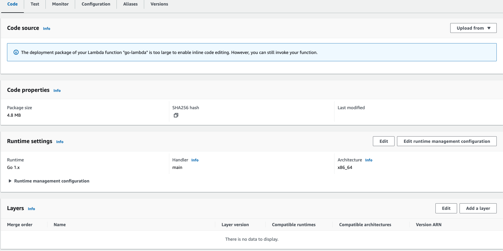
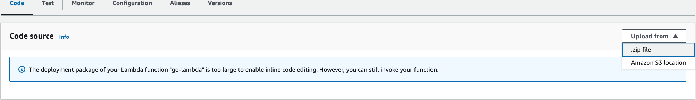
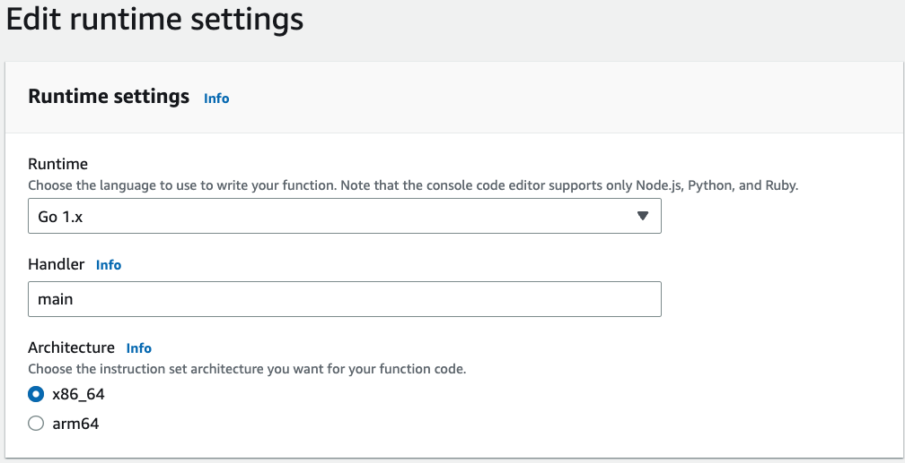

# LAMBDA CHAT BOT REMINDER

This code can build a reminder functionality for slack via slack app and golang lambda function. It post a message to a specific channel.
The work is designed to use the serverless aws lambda function.

### Tests run
```
go test ./... 
```

Will run all the unit tests.

### Create the binary
```
GOOS=linux GOARCH=amd64 go build -o main main.go
```

### Create the zip

```
zip main.zip main
```
### Upload and configure amazon lambda

#### Create lambda function

Navigate to aws console lambda panel. Create lambda function. 



#### Upload



#### Handler



#### Configure aws lambda environmental variables

Navigate to your lambda function and configure Environment variables. Your slack values need to be get from your slack app.

```
SLACK_URL - usually that is the value but for configuration purpose is taken out for easier configuration. https://slack.com/api/
SLACK_TOKEN - xoxb-asflwmfj
REMIND_CHANNEL - ADFKGHJEK
```

To configure Slack chat app follow this https://api.slack.com/authentication/basics.
